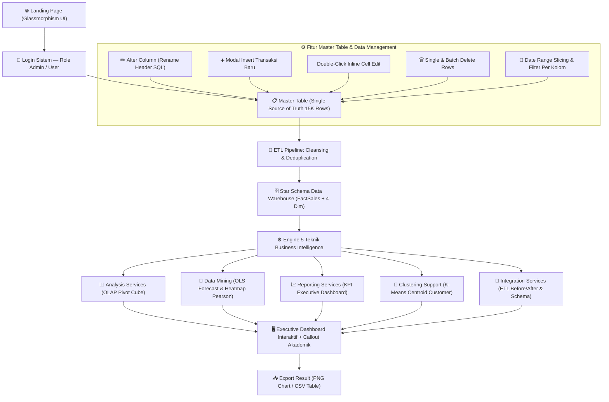
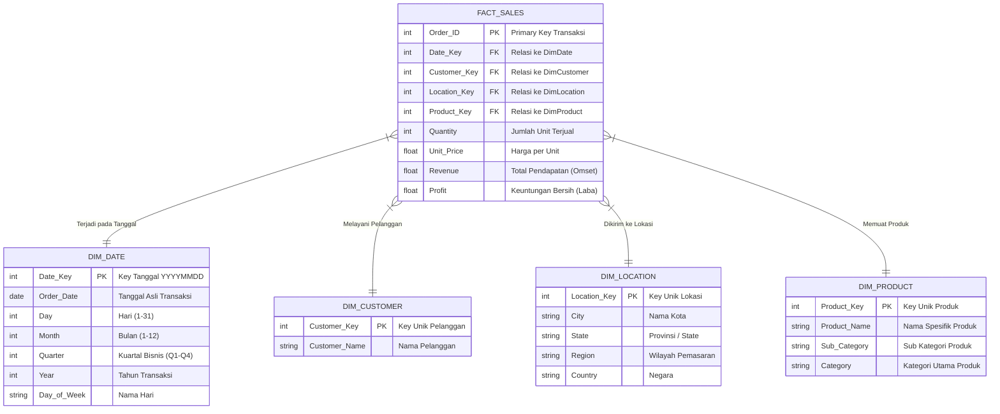

# 📊 PERENCANAAN PROYEK BUSINESS INTELLIGENCE & DATA WAREHOUSE
### Mata Kuliah: Business Intelligence — Semester 6
> **Nama Proyek:** BI Dashboard Analytics — Single Source of Truth & Business Decision Support System  
> **Teknologi:** React.js 18 · Chart.js 4 · K-Means Clustering · Vite 6 · SQL Star Schema  
> **Dataset Utama:** Dataset Penjualan Produk E-Commerce (~15.000 Transaksi / 15K Rows)  
> **Hosting & Live Demo:** GitHub Pages — [https://Yoohash-noob.github.io/bi-dashboard-analytics/](https://Yoohash-noob.github.io/bi-dashboard-analytics/)  
> **Repository GitHub:** [Yoohash-noob/bi-dashboard-analytics](https://github.com/Yoohash-noob/bi-dashboard-analytics)

---

## 📌 APA TUJUAN PROYEK INI?

Membuat sistem **Business Intelligence (BI) & Executive Dashboard** berbasis browser yang mampu:
1. Menampilkan **Landing Page** modern (Glassmorphism UI) sebelum masuk sistem
2. Sistem **Akses Berbasis Role** (Admin dengan full CRUD & Schema Editing; User/Eksekutif read-only)
3. Mengolah **Dataset 15.000 Transaksi Penjualan** secara *real-time* tanpa backend/server
4. Memasukkan data ke dalam **Master Table (Pusat Data Penjualan Utama)** dengan kemampuan **Dynamic Schema Alteration (`ALTER TABLE RENAME COLUMN`)**, Batch Selection, Date Slicing, & Health Bar Status
5. Menjalankan alur **ETL (Extract, Transform, Load)** dan transformasi data ke **Star Schema (1 Tabel Fakta & 4 Tabel Dimensi)**
6. Menyajikan **5 Teknik BI Utama** (Integration Services, Analysis Services OLAP, Data Mining OLS & Correlation, Reporting Services KPI, K-Means Clustering)
7. Memberikan **Penjelasan Akademik & Non-IT Callouts** di setiap visualisasi chart & modul agar dosen penguji memahami arti bisnis setiap variabel, cluster, dan grafik
8. Mendukung fitur **Download Multi-Format** (Grafik PNG & Dataset CSV)

---

## 🗺️ BAGIAN 1 — ALUR KERJA SISTEM (DATA FLOW ARCHITECTURE)



---

## 📊 BAGIAN 2 — STRUKTUR TABEL DATASET RAW (15.000 BARIS / 15K ROWS EXCEL & CSV)

Dataset utama yang diolah oleh sistem terdiri dari **15.000 baris data transaksi penjualan e-commerce** dengan 14 atribut/kolom utama. Berikut adalah **Kamus Data (Data Dictionary)** resmi dari dataset ini:

### 📋 Kamus Data Dataset Penjualan (15K Rows)

| No | Nama Kolom (Field Name) | Tipe Data SQL | Kategori Variabel | Deskripsi & Fungsi Bisnis | Contoh Nilai | Aturan Validasi ETL |
|:--:|-------------------------|---------------|-------------------|---------------------------|--------------|---------------------|
| 1 | `Order_ID` | `INT (PRIMARY KEY)` | Identifikasi (PK) | Nomor unik ID untuk setiap transaksi harian | `1`, `26`, `15000` | Harus unik, tidak boleh NULL, auto-increment pada insert baru |
| 2 | `Order_Date` | `DATE` | Dimensi Waktu | Tanggal transaksi dilakukan | `2023-08-23`, `2024-12-20` | Format standar ISO YYYY-MM-DD / MM-DD-YY, tidak boleh kosong |
| 3 | `Customer_Name` | `VARCHAR(100)` | Dimensi Pelanggan | Nama lengkap pelanggan pembeli | `Bianca Brown`, `Jared Edwards` | String dipangkas spasi (Trim), default 'Pelanggan Baru' jika kosong |
| 4 | `City` | `VARCHAR(50)` | Dimensi Geografi | Kota tujuan pengiriman barang | `Jackson`, `Boston`, `Seattle` | Nilai string nama kota valid |
| 5 | `State` | `VARCHAR(50)` | Dimensi Geografi | Provinsi / Negara Bagian pengiriman | `Mississippi`, `Washington` | Nama bagian/provinsi valid |
| 6 | `Region` | `VARCHAR(20)` | Dimensi Geografi | Wilayah pemasar (East, West, South, Centre) | `South`, `West`, `East` | Enumerasi 4 wilayah utama |
| 7 | `Country` | `VARCHAR(50)` | Dimensi Geografi | Negara tujuan pengiriman | `United States` | Default 'United States' |
| 8 | `Category` | `VARCHAR(50)` | Dimensi Produk | Kategori utama produk | `Accessories`, `Electronics`, `Clothing` | Pengelompokan tingkat 1 |
| 9 | `Sub_Category` | `VARCHAR(50)` | Dimensi Produk | Sub-kategori turunan produk | `Small Electronics`, `Smartphones` | Pengelompokan tingkat 2 |
| 10 | `Product_Name` | `VARCHAR(100)` | Dimensi Produk | Nama rinci produk yang dibeli | `Phone Case`, `MacBook Air` | Spesifikasi nama item produk |
| 11 | `Quantity` | `INT` | Ukuran (Measure) | Jumlah unit barang yang dibeli | `1`, `2`, `3`, `5` | Angka bulat positif (>= 1) |
| 12 | `Unit_Price` | `DECIMAL(10,2)` | Ukuran (Measure) | Harga jual per unit produk | `201.01`, `875.34` | Float/Decimal positif |
| 13 | `Revenue` | `DECIMAL(12,2)` | Ukuran (Measure) | Total omset (`Quantity * Unit_Price`) | `603.03`, `1750.68` | Rekalkulasi otomatis di ETL: `Qty * Price` |
| 14 | `Profit` | `DECIMAL(10,2)` | Ukuran (Measure) | Keuntungan bersih dari transaksi | `221.49`, `320.37` | Keuntungan bersih sesudah HPP |

---

## 🗄️ BAGIAN 3 — RANCANGAN DATA WAREHOUSE (STAR SCHEMA)

Sistem mengubah data mentah 15.000 baris menjadi **Star Schema Data Warehouse** yang terdiri dari **1 Tabel Fakta (FactSales)** dan **4 Tabel Dimensi (DimDate, DimCustomer, DimLocation, DimProduct)** untuk optimasi kueri analitis OLAP.



---

## 🛠️ BAGIAN 4 — FITUR MASTER TABLE & DYNAMIC SCHEMA MANAGEMENT

Master Table bertindak sebagai **Single Source of Truth (SSOT)** aplikasi dengan fitur pengelolaan data kelas *enterprise*:

1. **✏️ Dynamic Schema Alteration (`ALTER TABLE RENAME COLUMN`)**:
   - Pengguna/Admin dapat mengubah nama header kolom secara langsung di tabel (misal: mengganti `Order_Date` menjadi `Tanggal_Order`, atau `Revenue` menjadi `Omset`).
   - Perubahan nama header kolom langsung meretrukturasi seluruh 15.000 objek data secara *real-time* dan tersimpan otomatis ke `localStorage`.
2. **➕ Popup Modal Form Insert Transaksi Baru**:
   - Form input dengan validasi tipe data otomatis yang memperhitungkan `Revenue = Quantity * Unit_Price` dan memasukkan transaksi baru ke baris teratas.
3. **Double-Click Inline Cell Editing**:
   - Mengubah nilai sel mana pun secara cepat hanya dengan melakukan *double-click* pada sel tabel.
4. **🗑️ Selection Checkbox & Batch Delete**:
   - Memilih beberapa atau seluruh baris sekaligus untuk dihapus massal (*Bulk Delete*).
5. **📅 Multi-Column Filter & Date Range Slicing**:
   - Menyaring data berdasarkan rentang tanggal (*Start Date* s/d *End Date*) dan filter spesifik per kolom.
6. **🚦 System Health Bar & Indicator**:
   - Menampilkan status realtime integritas database, status *localStorage*, dan rasio kolom terlihat.

---

## 💡 BAGIAN 5 — PENJELASAN 5 TEKNIK BUSINESS INTELLIGENCE & CALLOUT AKADEMIK

### 🔄 1. Integration Services (ETL Pipeline)
* **Deskripsi:** Proses ekstraksi data CSV, pembersihan (*cleansing*) duplikat & nilai NULL, serta pembentukan skema bintang (*Star Schema*).
* **Penjelasan Akademik di Dashboard:** Menyediakan perbandingan sebelum/sesudah ETL (*Before/After Cleansing*) dan log integritas data secara visual.

### 📊 2. Analysis Services (OLAP Pivot Table & Slice & Dice)
* **Deskripsi:** Simulator multidimensi yang memungkinkan analisis agregasi variabel dari berbagai sudut (Baris: Category/Region; Kolom: Year/Quarter; Ukuran: Revenue/Profit).
* **Penjelasan Akademik di Dashboard:** Menjelaskan konsep *Slicing* (memotong data pada dimensi tertentu) dan *Dicing* (melihat kubus data dari 2 atau lebih dimensi sekaligus).

### 🔮 3. Data Mining (Forecasting OLS, Korelasi Pearson, & Market Basket)
* **Sub-modul Mining:**
  - **Forecasting Penjualan:** Menggunakan *Ordinary Least Squares (OLS) Linear Regression* untuk memprediksi pendapatan tren bulan mendatang beserta nilai $R^2$ dan kemiringan (*slope*).
  - **Heatmap Korelasi Pearson:** Menghitung koefisien korelasi $r$ antara Quantity, Unit Price, Revenue, dan Profit.
  - **Market Basket Analysis:** Menemukan pasangan produk yang paling sering dibeli bersamaan (*Co-occurrence rule*).
* **Penjelasan Akademik di Dashboard:** Panduan membaca nilai korelasi ($+1.0$ positif sempurna, $-1.0$ negatif) dan interpretasi variabel regresi.

### 📈 4. Reporting Services (Executive Dashboard & Chart Analysis)
* **KPI Cards:** Total Revenue, Total Profit, Profit Margin %, Total Quantity Terjual, Average Order Value, Total Transaksi.
* **4 Grafik Utama:**
  1. *Monthly Revenue Trend* (Line/Area Chart)
  2. *Revenue by Category* (Doughnut Chart)
  3. *Top 10 Products by Revenue* (Horizontal Bar Chart)
  4. *Revenue Distribution by Region* (Vertical Bar Chart)
* **Penjelasan Akademik di Dashboard:** Setiap grafik dilengkapi dengan kotak callout edukatif yang menjelaskan arti fungsional visualisasi bagi pembuat keputusan bisnis.

### 🎯 5. Clustering Support (K-Means Clustering)
* **Deskripsi:** Mengelompokkan pelanggan atau kota ke dalam $K$ klaster berdasarkan algoritma *K-Means* (jarak Euclidean dan normalisasi Min-Max).
* **4 Profil Segmen Pelanggan Utama:**
  - **Pembeli VIP:** Revenue Sangat Tinggi & Profit Tinggi.
  - **Pelanggan Premium:** Revenue Tinggi & Profit Stabil.
  - **Pembeli Grosir/Potensial:** Kuantitas Terjual Tinggi dengan Marjin Khusus.
  - **Pelanggan Kasual:** Frekuensi dan nilai transaksi rendah.
* **Penjelasan Akademik di Dashboard:** Scatter plot interaktif dengan penanda segitiga putih sebagai *Centroid* (titik pusat gravitasi klaster).

---

## 📁 BAGIAN 6 — STRUKTUR FOLDER REPOSITORI GITHUB

```text
archive/                                 ← Root folder repositori
├── README.md                            # Dokumentasi resmi GitHub
├── PLANNING.md                          # Dokumen Perencanaan & Kamus Data (File ini)
├── product_sales_dataset_15k.csv       # Dataset sampel 15.000 baris transaksi
├── product_sales_dataset_final.csv     # Dataset lengkap
├── customer_segments.csv               # Result klasterisasi pelanggan
├── etl_kmeans.py                       # Skrip Python data mining K-Means
├── generate_star_schema.py             # Skrip Python pembuatan Star Schema SQLite
│
├── sql/
│   ├── oltp_create.sql                 # Skrip SQL OLTP (3NF)
│   └── dw_create.sql                   # Skrip SQL Data Warehouse (Star Schema)
│
├── ssis/
│   └── ETL_DW_Workflow.md              # Dokumentasi SSIS Integration Workflow
├── ssas/
│   └── CubeDefinition.xmla             # Definisi XMLA OLAP Cube SSAS
├── ssrs/
│   └── SalesReport.rdl                 # Layout laporan SSRS
│
├── src/                                 # Source Code Frontend React (Vite)
│   ├── App.jsx                         # Shell aplikasi utama & navigasi tab
│   ├── index.css                       # Design System CSS (Glassmorphism Dark Theme)
│   │
│   ├── components/                     # Modul UI & Visualisasi BI
│   │   ├── LandingPage.jsx             # Halaman depan (Landing page)
│   │   ├── MasterTableTab.jsx          # Master Table & Alter Column Schema Editing
│   │   ├── IntegrationTab.jsx          # ETL & Visualisasi Star Schema
│   │   ├── AnalysisTab.jsx             # Simulator OLAP Pivot Table
│   │   ├── MiningTab.jsx               # Data Mining (Regresi & Korelasi)
│   │   ├── ReportingTab.jsx            # Laporan Dashboard & Grafik Interaktif
│   │   ├── ClusteringTab.jsx           # Scatter Plot K-Means & Profile Centroid
│   │   └── AlgorithmModal.jsx          # Modal Formula Algoritma & Kode Python
│   │
│   └── utils/                          # Algoritma Client-side & Helper
│       ├── etl.js                      # Cleansing & SQL Exporter
│       ├── clustering.js               # Algoritma K-Means Client-side
│       ├── mining.js                   # Regresi OLS & Korelasi Pearson
│       └── download.js                 # Export PNG & CSV
│
├── index.html                           # Entry point HTML5 & SEO Metadata
├── package.json                         # Dependensi NPM (React, Chart.js, Vite)
└── vite.config.js                       # Konfigurasi Build Vite
```

---

## 🛠️ BAGIAN 7 — REKOMENDASI PENINGKATAN & BEST PRACTICES UNTUK PRESENTASI DOSEN

Aplikasi dan dokumentasi ini telah dirancang untuk menangkal semua celah pertanyaan dosen penguji skripsi/tugas akhir:

1. **Jawab Celah Identitas Master Data:**  
   *Dosen*: "Kenapa dinamakan Master Table padahal isinya data transaksi?"  
   *Jawaban*: "Tabel ini dinamakan **Master Table Transaksi Penjualan** karena berfungsi sebagai *Single Source of Truth (SSOT)* — pusat penggabungan seluruh tabel transaksional yang sudah dibersihkan oleh pipeline ETL sebelum didistribusikan ke kubus OLAP dan klastering."

2. **Jawab Celah Fleksibilitas Skema:**  
   *Dosen*: "Bagaimana kalau struktur kolom dari file CSV beda penamaannya?"  
   *Jawaban*: "Sistem kami dilengkapi dengan fitur **Dynamic Schema Alteration (`ALTER TABLE RENAME COLUMN`)**. Nama header kolom dapat diubah secara *real-time* lewat tombol pensil (Edit Header), dan seluruh dataset 15.000 baris akan otomatis menyesuaikan diri tanpa merusak alur analitis."

3. **Jawab Celah Algoritma Data Mining:**  
   *Dosen*: "Bagaimana cara kerja K-Means dan Regresi di browser tanpa server?"  
   *Jawaban*: "Algoritma dieksekusi 100% *client-side* menggunakan JavaScript ES6+ dengan metode *Min-Max Normalization* dan *Euclidean Distance* untuk K-Means, serta *Ordinary Least Squares (OLS)* untuk regresi linear. Pengguna juga dapat menekan tombol **Modal Algoritma** untuk melihat kode versi Python scikit-learn nya."

4. **Jawab Celah Keamanan & Akses:**  
   *Dosen*: "Siapa saja yang boleh mengubah data?"  
   *Jawaban*: "Sistem memiliki **Role-Based Access Control (RBAC)**. Mode Admin memiliki izin full CRUD & Schema Alteration, sedangkan mode User/Eksekutif hanya memiliki akses *read-only* untuk melihat KPI dan laporan grafik."

---

## ⚙️ BAGIAN 8 — TEKNOLOGI & LIVE DEPLOYMENT

| Komponen | Teknologi | Keterangan |
|----------|-----------|------------|
| **Frontend UI** | React.js 18 + Vite 6 | SPA (Single Page Application) super cepat |
| **Styling & Theme** | Vanilla CSS 3 | Custom Glassmorphism Dark Mode |
| **Grafik & Visual** | Chart.js 4 + react-chartjs-2 | Line, Bar, Doughnut, Scatter Chart |
| **Pembersihan Data** | PapaParse + JavaScript ES6+ | Real-time CSV Parsing & Cleansing |
| **Database OLTP & DW** | T-SQL (Microsoft SQL Server) & SQLite | Script pembuatan `sql/` & `generate_star_schema.py` |
| **Hosting & CI/CD** | GitHub Pages | Automated deployment dari branch `gh-pages` |

---

*Dokumen Perencanaan ini di-update secara komprehensif pada: 2026-07-29 — Versi Final (Siap Sidang & Presentasi)*
