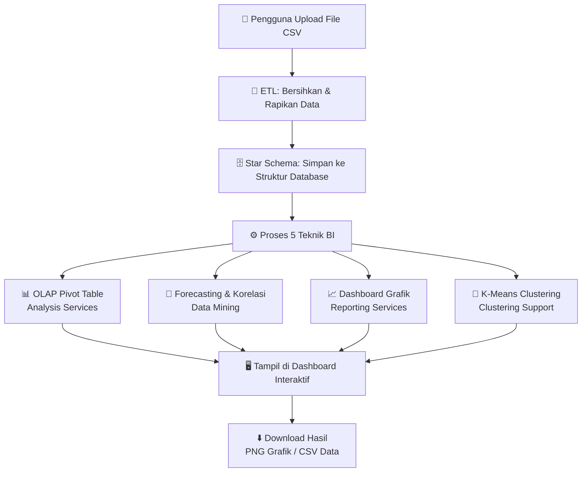
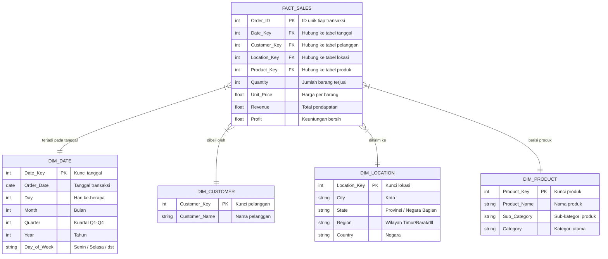
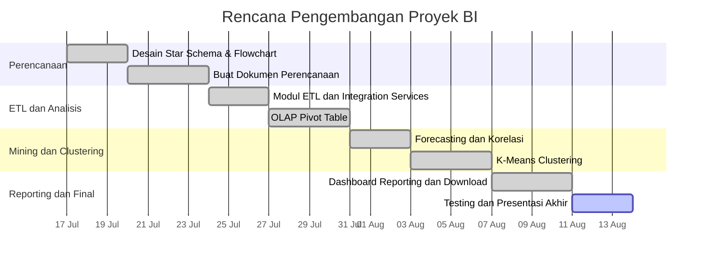

# 📊 PERENCANAAN PROYEK BUSINESS INTELLIGENCE
### Mata Kuliah: Business Intelligence — Semester 6
> **Nama Proyek:** BI Dashboard — Analisis Data Penjualan Produk  
> **Teknologi:** React.js · Chart.js · K-Means · Vite  
> **Dataset:** Data penjualan produk (CSV, ~15.000 baris)

---

## 📌 APA TUJUAN PROYEK INI?

Membuat sebuah **website dashboard** yang bisa:
1. Menerima file data penjualan (CSV) dari pengguna
2. Membersihkan dan merapikan data secara otomatis (ETL)
3. Menampilkan analisis lengkap menggunakan **5 teknik Business Intelligence**
4. Menyediakan fitur **download hasil** (grafik PNG & tabel CSV)

---

## 🗺️ BAGIAN 1 — ALUR KERJA SISTEM

> Bagaimana data bergerak dari file CSV sampai menjadi hasil analisis di layar?



### 📖 Penjelasan Alur (Mudah Dipresentasikan):

| Langkah | Nama | Penjelasan Singkat |
|---------|------|--------------------|
| 1️⃣ | **Input** | Pengguna upload file CSV berisi data penjualan |
| 2️⃣ | **ETL** | Sistem otomatis membersihkan data (buang duplikat, perbaiki format, isi nilai kosong) |
| 3️⃣ | **Star Schema** | Data disimpan dalam struktur tabel yang terorganisir (1 fakta + 4 dimensi) |
| 4️⃣ | **Proses BI** | Data diolah dengan 5 teknik BI sekaligus |
| 5️⃣ | **Output** | Hasil muncul di dashboard sebagai grafik, tabel, dan angka statistik |
| 6️⃣ | **Download** | Pengguna bisa download grafik (PNG) atau data (CSV) |

---

## 🗄️ BAGIAN 2 — RANCANGAN DATABASE (Star Schema)

> **Star Schema** adalah cara menyimpan data warehouse. Ada 1 tabel utama (Fakta) yang dikelilingi oleh tabel pendukung (Dimensi), seperti bentuk bintang.



### 📖 Penjelasan Tabel (Untuk Presentasi):

| Tabel | Jenis | Isi | Fungsi |
|-------|-------|-----|--------|
| `FACT_SALES` | **Fakta** | Angka transaksi (Revenue, Profit, Qty) | Tabel utama tempat data bisnis |
| `DIM_DATE` | Dimensi | Info tanggal, bulan, kuartal, tahun | Filter data berdasarkan waktu |
| `DIM_CUSTOMER` | Dimensi | Nama pelanggan | Analisis per pelanggan |
| `DIM_LOCATION` | Dimensi | Kota, wilayah, negara | Analisis per lokasi/region |
| `DIM_PRODUCT` | Dimensi | Nama & kategori produk | Analisis per produk |

---

## 💡 BAGIAN 3 — PENJELASAN 5 FITUR BI

### 🔄 Fitur 1: Integration Services (ETL)
> *"Proses membersihkan data kotor agar siap dianalisis"*

**Cara kerjanya:**
- Sistem membaca file CSV yang di-upload pengguna
- Otomatis menghapus data duplikat dan baris kosong
- Memperbaiki format tanggal yang tidak konsisten
- Memisahkan data ke dalam tabel Star Schema

**Output yang bisa dilihat:**
- ✅ Log proses ETL (berhasil/gagal per langkah)
- ✅ Tampilan skema tabel sebelum dan sesudah ETL
- ✅ Statistik jumlah data: berapa yang bersih, berapa yang dibuang

---

### 📊 Fitur 2: Analysis Services (OLAP Pivot Table)
> *"Tabel interaktif untuk melihat data dari berbagai sudut pandang"*

**Cara kerjanya:**
- Pengguna bebas memilih: **baris** (misal: Kategori), **kolom** (misal: Tahun), dan **nilai** (misal: Revenue)
- Bisa difilter berdasarkan Region, Kategori, atau Tahun
- Ada tombol expand untuk melihat detail sub-baris (drill-down)

**Contoh penggunaan:**
- "Berapa revenue Kategori Elektronik di setiap tahun?"
- "Bandingkan profit per wilayah di Q3"

**Output yang bisa dilihat:**
- ✅ Tabel pivot interaktif
- ✅ Grand Total otomatis di bawah tabel
- ✅ Download hasil pivot sebagai CSV

---

### 🔮 Fitur 3: Data Mining
> *"Menemukan pola tersembunyi dan memprediksi masa depan"*

**3 sub-fitur:**

| Sub-fitur | Penjelasan | Output |
|-----------|------------|--------|
| **Forecasting** | Prediksi penjualan bulan ke depan (regresi linear) | Grafik garis dengan prediksi |
| **Korelasi** | Ukur hubungan antar variabel (Qty, Harga, Profit) | Heatmap matriks korelasi |
| **Market Basket** | Produk yang sering dibeli bersamaan | Tabel & grafik 10 pasangan |

**Output yang bisa dilihat:**
- ✅ Grafik Forecasting (pilih 3, 6, 9, atau 12 bulan ke depan)
- ✅ Koefisien R² dan Slope tren penjualan
- ✅ Download grafik PNG & data CSV

---

### 📈 Fitur 4: Reporting Services
> *"Dashboard laporan visual yang siap dipresentasikan"*

**Grafik yang tersedia:**

| Grafik | Penjelasan |
|--------|------------|
| 📉 Monthly Trend | Tren pendapatan per bulan |
| 🍩 Revenue by Category | Kontribusi tiap kategori (donat) |
| 🏆 Top 10 Products | Produk dengan revenue tertinggi |
| 🗺️ Revenue by Region | Perbandingan revenue per wilayah |

**KPI yang ditampilkan:**
💰 Total Revenue · 💹 Total Profit · 📊 Profit Margin · 📦 Total Qty · 🛒 Avg Order Value · 🔢 Total Orders

**Output yang bisa dilihat:**
- ✅ 6 kartu KPI di bagian atas
- ✅ 4 grafik interaktif
- ✅ Tabel Top 20 Pelanggan
- ✅ Download tiap grafik (PNG) dan tiap tabel (CSV)

---

### 🎯 Fitur 5: Clustering Support (K-Means)
> *"Mengelompokkan pelanggan berdasarkan kemiripan perilaku belanja"*

**Cara kerjanya:**
- Algoritma K-Means mengelompokkan data ke dalam K kelompok
- Pengguna pilih: jumlah cluster (2–6), sumbu X dan Y, mode (Pelanggan atau Kota)
- Algoritma berjalan langsung di browser, tidak perlu server

**Contoh hasil:**

| Cluster | Profil | Ciri-ciri |
|---------|--------|-----------|
| Cluster 1 | VIP Customer | Revenue tinggi, sering beli |
| Cluster 2 | Bulk Buyer | Order banyak tapi nilai kecil |
| Cluster 3 | Occasional Spender | Jarang beli tapi sekali beli mahal |

**Output yang bisa dilihat:**
- ✅ Scatter Plot interaktif dengan warna tiap cluster
- ✅ Profil tiap cluster (nama, jumlah anggota, rata-rata nilai)
- ✅ Download scatter plot (PNG) dan data cluster (CSV)

---

## 📁 BAGIAN 4 — STRUKTUR FOLDER PROYEK

```
📦 archive/                         ← Root folder proyek
│
├── 📁 src/                         ← Kode sumber utama (React)
│   ├── 📄 App.jsx                  ← Komponen utama aplikasi
│   ├── 📄 index.css                ← Styling & design sistem
│   │
│   ├── 📁 components/              ← Komponen UI per tab
│   │   ├── IntegrationTab.jsx      ← Tab ETL & Star Schema
│   │   ├── AnalysisTab.jsx         ← Tab OLAP Pivot Table
│   │   ├── MiningTab.jsx           ← Tab Data Mining
│   │   ├── ReportingTab.jsx        ← Tab Dashboard Laporan
│   │   ├── ClusteringTab.jsx       ← Tab K-Means Clustering
│   │   ├── AlgorithmModal.jsx      ← Modal penjelasan algoritma
│   │   └── ErrorBanner.jsx         ← Notifikasi error upload
│   │
│   └── 📁 utils/                   ← Fungsi logika/kalkulasi
│       ├── etl.js                  ← Proses ETL & transformasi data
│       ├── clustering.js           ← Algoritma K-Means
│       ├── mining.js               ← Forecasting & korelasi
│       └── download.js             ← Helper download PNG & CSV
│
├── 📁 public/                      ← File statis
├── 📁 sql/                         ← Script SQL Star Schema
├── 📁 ssis/                        ← Desain SSIS (ETL Microsoft)
├── 📁 ssas/                        ← Desain SSAS (Cube)
├── 📁 ssrs/                        ← Desain SSRS (Report)
│
├── 📄 package.json                 ← Konfigurasi Node.js
├── 📄 vite.config.js               ← Konfigurasi build
├── 📄 README.md                    ← Dokumentasi proyek
└── 📄 PLANNING.md                  ← Dokumen perencanaan ini
```

---

## 📅 BAGIAN 5 — TIMELINE PENGERJAAN



| Minggu | Fokus | Status |
|--------|-------|--------|
| **Minggu 1** | Perencanaan, desain database, buat dokumen | ✅ Selesai |
| **Minggu 2** | ETL pipeline, OLAP Pivot Table interaktif | ✅ Selesai |
| **Minggu 3** | Forecasting, korelasi, K-Means clustering | ✅ Selesai |
| **Minggu 4** | Dashboard reporting, fitur download, presentasi | 🔄 Berjalan |

---

## ⚙️ BAGIAN 6 — TEKNOLOGI YANG DIGUNAKAN

| Teknologi | Fungsi |
|-----------|--------|
| **React.js 18** | Framework UI komponen |
| **Vite 6** | Build tool & dev server cepat |
| **Chart.js 4** | Render grafik (Line, Bar, Scatter, Doughnut) |
| **PapaParse** | Parse file CSV langsung di browser |
| **Vanilla CSS** | Styling & dark mode premium |
| **JavaScript ES6+** | Logika algoritma (K-Means, regresi linear, ETL) |

> 💡 **Catatan:** Semua proses berjalan 100% di browser (client-side). Tidak membutuhkan server backend atau database eksternal.

---

## 🎯 BAGIAN 7 — RINGKASAN UNTUK PRESENTASI

Jika dosen bertanya *"Jelaskan proyekmu secara singkat"*, gunakan kalimat ini:

> *"Proyek ini adalah **website Business Intelligence** berbasis browser yang mengolah data penjualan CSV secara real-time. Sistemnya mencakup 5 teknik BI utama: **ETL** untuk pembersihan data, **OLAP Pivot Table** untuk analisis multidimensi, **Data Mining** untuk prediksi dan korelasi, **Reporting Dashboard** dengan grafik interaktif, dan **K-Means Clustering** untuk segmentasi pelanggan. Semua hasilnya bisa diunduh langsung sebagai file PNG atau CSV."*

---

*Dokumen ini siap diupload ke GitHub sebagai bagian dari dokumentasi proyek.*
