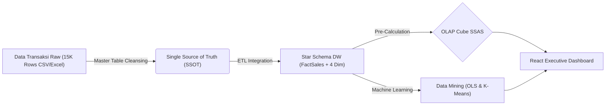
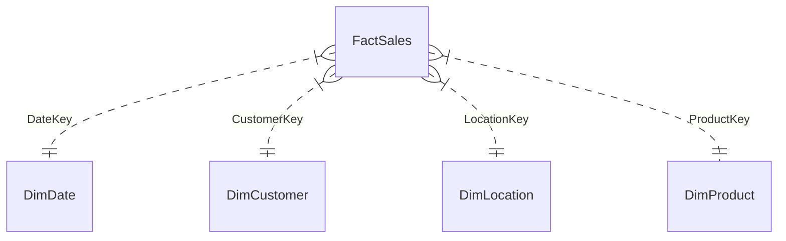

# Business Intelligence Dashboard Analytics & Data Warehouse Project

Proyek ini adalah implementasi sistem **Business Intelligence (BI) & Executive Decision Support System** berbasis web yang komprehensif. Proyek mengintegrasikan perancangan database transaksional (OLTP 3NF), Gudang Data (Data Warehouse - Star Schema), alur integrasi data (ETL SSIS & Client-side Cleansing), pemodelan multidimensi (OLAP Cube SSAS), visualisasi pelaporan (SSRS & Chart.js), pencarian pola data (Data Mining OLS Linear Regression & K-Means Clustering), serta **Master Table dengan Dynamic Schema Alteration (`ALTER TABLE RENAME COLUMN`)**.

🌍 **Live Demo GitHub Pages:** [https://Yoohash-noob.github.io/bi-dashboard-analytics/](https://Yoohash-noob.github.io/bi-dashboard-analytics/)

---

## 🎯 Latar Belakang & Tujuan Bisnis
Proyek ini dibangun untuk menyelesaikan masalah analisis data penjualan e-commerce yang besar (~15.000 transaksi) dan kompleks. Tujuannya adalah:
1. Menyediakan **Single Source of Truth (SSOT)** melalui Master Table & Data Warehouse Star Schema.
2. Memudahkan eksekutif dan manajemen memantau KPI pendapatan, laba bersih, dan tren penjualan secara *real-time*.
3. Menyediakan modul **Dynamic Schema Alteration** (`ALTER TABLE RENAME COLUMN`) langsung di UI tabel.
4. Menerapkan algoritma **Data Mining (K-Means Clustering)** untuk segmentasi pelanggan (VIP, Premium, Potensial, Kasual) dan **Regresi Linear (OLS)** untuk peramalan penjualan.
5. Memberikan **penjelasan edukatif (Callout Akademik)** pada setiap grafik agar hasil analisis mudah dipahami oleh pengambil keputusan maupun evaluator akademis.

---

## 🏗️ Arsitektur Sistem (Data Flow)


---

## 📊 Kamus Data Dataset Penjualan (15.000 Baris / 15K Rows)

Berikut adalah struktur tabel data mentah (*Raw Dataset*) yang digunakan dalam proyek ini:

| No | Kolom (Field Name) | Tipe Data | Peran | Deskripsi | Contoh Nilai |
|:--:|--------------------|-----------|-------|-----------|--------------|
| 1 | `Order_ID` | `INT` | Primary Key | ID Unik untuk setiap baris transaksi | `1`, `26`, `15000` |
| 2 | `Order_Date` | `DATE` | Waktu | Tanggal transaksi dilakukan (YYYY-MM-DD) | `2023-08-23` |
| 3 | `Customer_Name` | `VARCHAR(100)` | Pelanggan | Nama lengkap pelanggan pembeli | `Bianca Brown` |
| 4 | `City` | `VARCHAR(50)` | Geografi | Kota pengiriman barang | `Jackson`, `Seattle` |
| 5 | `State` | `VARCHAR(50)` | Geografi | Provinsi / State pengiriman | `Mississippi` |
| 6 | `Region` | `VARCHAR(20)` | Geografi | Wilayah pemasar (East, West, South, Centre) | `South`, `West` |
| 7 | `Country` | `VARCHAR(50)` | Geografi | Negara tujuan | `United States` |
| 8 | `Category` | `VARCHAR(50)` | Produk | Kategori utama produk | `Accessories`, `Electronics` |
| 9 | `Sub_Category` | `VARCHAR(50)` | Produk | Sub-kategori produk | `Small Electronics` |
| 10 | `Product_Name` | `VARCHAR(100)` | Produk | Nama rinci produk yang dibeli | `Phone Case`, `MacBook Air` |
| 11 | `Quantity` | `INT` | Measure | Jumlah barang yang dibeli | `3`, `5` |
| 12 | `Unit_Price` | `DECIMAL(10,2)` | Measure | Harga per unit barang | `201.01` |
| 13 | `Revenue` | `DECIMAL(12,2)` | Measure | Total omset (`Quantity * Unit_Price`) | `603.03` |
| 14 | `Profit` | `DECIMAL(10,2)` | Measure | Keuntungan bersih transaksi | `221.49` |

---

## 🗄️ Perancangan Data Warehouse (Star Schema)

Data Warehouse dimodelkan dalam bentuk **Star Schema** yang terdiri dari 1 Tabel Fakta (`FactSales`) dan 4 Tabel Dimensi (`DimDate`, `DimCustomer`, `DimLocation`, `DimProduct`).



---

## 🚀 Fitur Utama Dashboard

### 1. 📋 Master Table (Single Source of Truth)
- **Dynamic Schema Alteration (`ALTER TABLE RENAME COLUMN`)**: Klik ikon pensil ✏️ / edit pada header kolom mana saja untuk mengganti nama kolom secara *real-time*.
- **Modal Insert Transaksi**: Tambahkan data transaksi baru dengan validasi otomatis.
- **Inline Cell Editing & Bulk Delete**: Double-click untuk mengedit nilai sel; gunakan checkbox untuk menghapus massal.
- **Date Range Slicing & Field Filters**: Filter data berdasarkan periode waktu dan kata kunci per kolom.

### 2. 🔄 Integration Services (ETL)
- Visualisasi skema Star Schema dan log *before/after* pembersihan data.

### 3. 📊 Analysis Services (OLAP Cube)
- Matrix Slice & Dice interaktif untuk menganalisis variabel bisnis antar-dimensi.

### 4. 🔮 Data Mining
- Regresi Linear OLS (Forecasting tren penjualan), Heatmap Korelasi Pearson, dan Market Basket Analysis.

### 5. 📈 Reporting Services & Executive KPI
- KPI Cards & 4 grafik interaktif (Line, Bar, Doughnut) dilengkapi penjelasan akademik.

### 6. 🎯 Clustering Support (K-Means)
- Klasterisasi segmen pelanggan (VIP, Premium, Potensial, Kasual) dengan plot centroid interaktif.

---

## 📂 Struktur Folder Repositori

```text
archive/
├── README.md                     # Dokumentasi utama proyek untuk GitHub
├── PLANNING.md                   # Dokumen Perencanaan & Kamus Data 15K Rows
├── product_sales_dataset_15k.csv # Dataset transaksi sampel (15.000 records)
├── generate_star_schema.py       # Skrip Python otomatisasi pembentukan DW & populasi
├── etl_kmeans.py                 # Skrip Python data mining K-Means clustering
│
├── sql/
│   ├── oltp_create.sql            # Skrip T-SQL pembuatan database OLTP (3NF)
│   └── dw_create.sql              # Skrip T-SQL pembuatan Data Warehouse (Star Schema)
│
├── ssis/
│   └── ETL_DW_Workflow.md         # Dokumentasi alur ETL SSIS
├── ssas/
│   └── CubeDefinition.xmla        # Skrip XMLA SSAS OLAP Cube
├── ssrs/
│   └── SalesReport.rdl            # Layout SSRS Report
│
└── src/                           # Source code frontend dashboard React (Vite)
    ├── components/                # Komponen tab visualisasi BI
    ├── utils/                     # Algoritma client-side & helpers
    └── index.css                  # Style CSS Dark Mode Glassmorphism
```

---

## 💻 Cara Menjalankan Secara Lokal

```bash
# 1. Install dependensi
npm install

# 2. Jalankan server pengembangan
npm run dev

# 3. Akses di browser: http://localhost:5173/
```

---

*Dikembangkan untuk Tugas Akhir / Mata Kuliah Business Intelligence — Semester 6*
