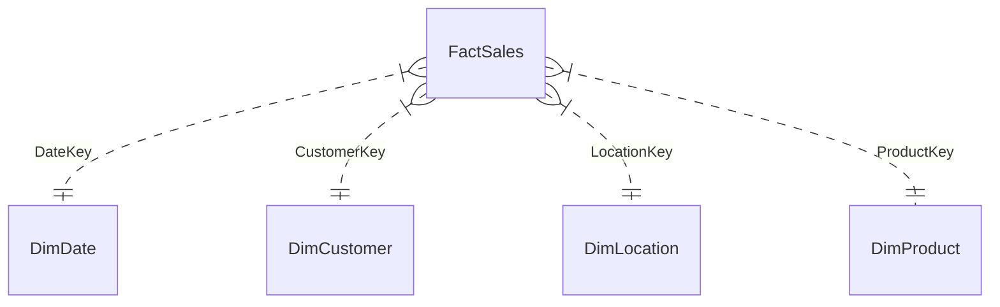

# Business Intelligence Dashboard & Data Warehouse Project

Proyek ini adalah implementasi lengkap solusi **Business Intelligence (BI)** untuk analisis data penjualan. Proyek ini mencakup perancangan database transaksional (OLTP), gudang data (Data Warehouse - Star Schema), alur integrasi data (ETL menggunakan SSIS), pemodelan multidimensi (Cube menggunakan SSAS), visualisasi pelaporan (SSRS), pencarian pola data (Data Mining K-Means), serta aplikasi dashboard interaktif berbasis web (React + Vite).

---

## 📂 Struktur Folder Proyek
Seluruh aset perancangan, skrip, dan kode terorganisasi sebagai berikut:
```text
archive/
│   README.md                     # Dokumentasi utama proyek untuk GitHub
│   generate_star_schema.py        # Skrip Python otomatisasi pembentukan DW & populasi
│   etl_kmeans.py                 # Skrip Python data mining K-Means clustering
│   product_sales_dataset_15k.csv # Dataset transaksi sampel (15.000 records)
│   package.json                  # Konfigurasi Node.js & dependencies
│
├── sql/
│   ├── oltp_create.sql            # Skrip T-SQL pembuatan database OLTP (3NF)
│   └── dw_create.sql              # Skrip T-SQL pembuatan Data Warehouse (Star Schema)
│
├── ssis/
│   └── ETL_DW_Workflow.md         # Dokumentasi rancangan alur ETL SSIS lengkap
│
├── ssas/
│   └── CubeDefinition.xmla        # Skrip XMLA SSAS untuk pendefinisian OLAP Cube
│
├── ssrs/
│   └── SalesReport.rdl            # Definisi SSRS Report Layout XML
│
└── src/                           # Source code frontend dashboard React (Vite)
    ├── components/                # Komponen tab visualisasi BI
    ├── utils/                     # Algoritma & helper logika client-side
    └── index.css                  # Desain tema premium gelap (Glassmorphism)
```

---

## 1️⃣ Perancangan Database (OLTP)
Database OLTP dirancang dalam bentuk **3NF (Third Normal Form)** untuk meminimalisasi redundansi data pada proses transaksional harian.
*   **Skrip Pembuatan**: [oltp_create.sql](file:///C:/Users/Windows%2010/Documents/Tugas/Semester%206/task/archive/sql/oltp_create.sql)
*   **Entitas Utama**:
    *   `dbo.Locations`: Menyimpan data geografis (City, State, Region, Country).
    *   `dbo.Customers`: Relasi pelanggan yang merujuk pada `Locations`.
    *   `dbo.Products`: Informasi detail produk (Category, SubCategory).
    *   `dbo.Orders`: Header pemesanan berisi tanggal order dan informasi pengiriman.
    *   `dbo.OrderDetails`: Detail baris produk per transaksi (Quantity, UnitPrice, Discount, Profit).

---

## 2️⃣ Perancangan Data Warehouse (Star Schema)
Data Warehouse (DW) dimodelkan menggunakan **Star Schema** untuk optimalisasi performa kueri analitis (OLAP).
*   **Skrip Pembuatan**: [dw_create.sql](file:///C:/Users/Windows%2010/Documents/Tugas/Semester%206/task/archive/sql/dw_create.sql)
*   **Skema Hubungan (Mermaid ERD)**:

*   **Tabel Fakta**: `FactSales` (menyimpan kunci referensi dimensi & ukuran kuantitatif: Quantity, UnitPrice, Discount, Revenue, Profit).
*   **Tabel Dimensi**:
    *   `DimDate`: Berisi rincian kalender (Tahun, Kuartal, Bulan, Hari, IsWeekend).
    *   `DimCustomer`: Dimensi pelanggan dengan pelacakan perubahan SCD Type 2.
    *   `DimLocation`: Dimensi lokasi geografi penjualan.
    *   `DimProduct`: Klasifikasi hierarki produk.

---

## 3️⃣ Integrasi Data (ETL menggunakan SSIS)
Proses ETL dirancang menggunakan **SQL Server Integration Services (SSIS)** untuk memindahkan data secara berkala dari database OLTP ke Data Warehouse.
*   **Dokumentasi Alur**: [ETL_DW_Workflow.md](file:///C:/Users/Windows%2010/Documents/Tugas/Semester%206/task/archive/ssis/ETL_DW_Workflow.md)
*   **Logika Transformasi**:
    *   **Pembersihan Data**: Melakukan trim spasi pada string kategori/produk.
    *   **Derivasi DateKey**: Mengubah tipe data tanggal transaksi menjadi format integer `YYYYMMDD`.
        *   *Formula SSIS*: `(DT_I4)((DT_WSTR, 4)YEAR(OrderDate) + RIGHT("0" + (DT_WSTR, 2)MONTH(OrderDate), 2) + RIGHT("0" + (DT_WSTR, 2)DAY(OrderDate), 2))`
    *   **Lookup mapping**: Pencarian surrogate key dari database DW dimensi untuk dipasangkan ke tabel fakta.

---

## 4️⃣ Pemodelan Kubus (SSAS)
Menggunakan **SQL Server Analysis Services (SSAS)** untuk agregasi pra-kalkulasi data penjualan agar kueri dashboard berjalan instan.
*   **Rancangan**: [CubeDefinition.xmla](file:///C:/Users/Windows%2010/Documents/Tugas/Semester%206/task/archive/ssas/CubeDefinition.xmla)
*   **Ukuran (Measures)**:
    *   `Total Revenue` (Sum)
    *   `Total Profit` (Sum)
    *   `Total Quantity` (Sum)
*   **Dimensi & Hierarki**:
    *   *Product*: Category $\rightarrow$ Sub-Category $\rightarrow$ Product Name.
    *   *Time*: Calendar Year $\rightarrow$ Calendar Quarter $\rightarrow$ Month Name $\rightarrow$ Full Date.
    *   *Geography*: Region $\rightarrow$ State $\rightarrow$ City.

---

## 5️⃣ Pelaporan (SSRS)
Rancangan laporan operasional menggunakan **SQL Server Reporting Services (SSRS)**.
*   **Layout Laporan**: [SalesReport.rdl](file:///C:/Users/Windows%2010/Documents/Tugas/Semester%206/task/archive/ssrs/SalesReport.rdl)
*   **Kueri Sumber Data**: Melakukan agregasi data penjualan berdasarkan Tahun, Wilayah, dan Kategori Produk untuk diekspor ke format PDF/Excel.

---

## 6️⃣ Data Mining (K-Means Clustering)
Modul data mining mengelompokkan pelanggan ke dalam **4 segmen utama** berdasarkan total pembelian (`Revenue`), kuantitas produk (`Quantity`), dan tingkat laba bersih (`Profit`).
*   **Kode Implementasi**: [etl_kmeans.py](file:///C:/Users/Windows%2010/Documents/Tugas/Semester%206/task/archive/etl_kmeans.py)
*   **Metodologi**:
    1.  Agregasi data transaksi per nama pelanggan.
    2.  Normalisasi fitur menggunakan **Min-Max Scaling** agar kontribusi tiap parameter seimbang.
    3.  Perhitungan klasterisasi menggunakan **Euclidean Distance**.
    4.  Pemberian profil segmen:
        *   **VIP**: Pembelian bernilai sangat tinggi dan kuantitas besar.
        *   **Premium**: Pembelian tinggi dengan kontribusi profit stabil.
        *   **Potensial**: Rata-rata transaksi sedang.
        *   **Kasual**: Frekuensi dan volume transaksi rendah.

---

## 🚀 Cara Menjalankan & Menguji Proyek

### 1. Menjalankan Dashboard React (Lokal)
1.  Pastikan Node.js sudah terinstal.
2.  Buka folder `archive` di terminal, lalu jalankan:
    ```bash
    npm install
    npm run dev
    ```
3.  Buka browser pada alamat: **`http://localhost:5173/`**
4.  Unggah file `product_sales_dataset_15k.csv` pada landing page untuk melihat visualisasi grafik, tabel pivot interaktif, dan simulasi K-Means client-side.

### 2. Menjalankan Star Schema & Data Mining (Python)
Jika Anda ingin membangun data warehouse portable (SQLite) dan menjalankan K-Means lokal via terminal:
1.  Jalankan pembuat data warehouse:
    ```bash
    python generate_star_schema.py
    ```
    *Ini akan menghasilkan file database relational SQL `sales_dw.db` yang terisi data dari CSV.*
2.  Jalankan skrip clustering data mining:
    ```bash
    python etl_kmeans.py
    ```
    *Menghasilkan file hasil clustering pelanggan `customer_segments.csv` beserta rangkuman centroid segmen.*

---

## 💻 Panduan Upload ke GitHub
Gunakan langkah berikut untuk meng-upload proyek ini ke repositori GitHub Anda:

```bash
# 1. Inisialisasi repositori Git lokal
git init

# 2. Tambahkan file yang ingin dilacak (.gitignore abaikan node_modules)
echo "node_modules/" > .gitignore
echo "dist/" >> .gitignore
echo "*.db" >> .gitignore

# 3. Commit berkas rancangan
git add .
git commit -m "Initial commit: Rancangan Lengkap OLTP, DW, SSIS, SSAS, SSRS, Data Mining Python dan Dashboard Web"

# 4. Hubungkan ke repositori GitHub Anda (ganti URL di bawah)
git branch -M main
git remote add origin https://github.com/USERNAME/NAMA_REPOSITORI.git

# 5. Push kode
git push -u origin main
```
