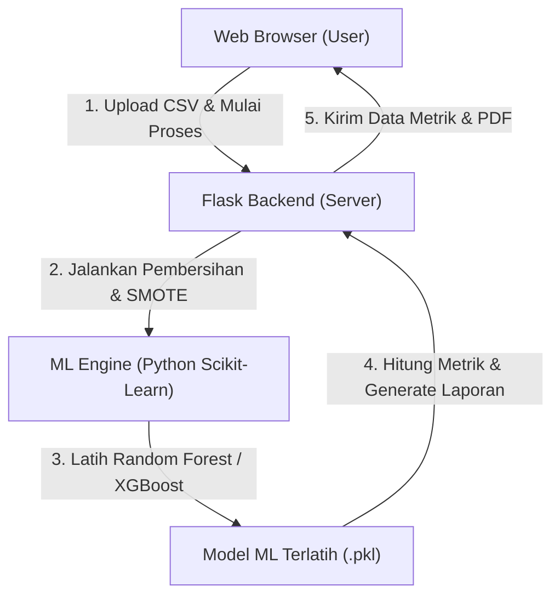
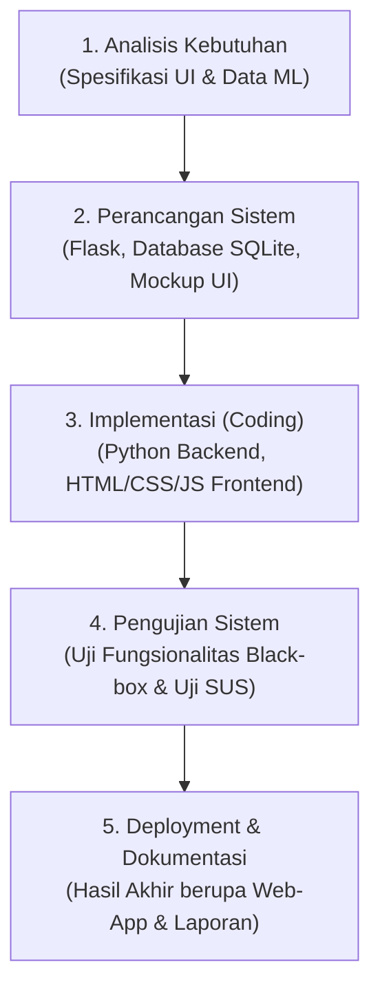

# PROPOSAL SKRIPSI

## IMPLEMENTASI PLATFORM NO-CODE MACHINE LEARNING BERBASIS FRAMEWORK FLASK UNTUK OTOMATISASI EVALUASI DAN SINTESIS DATA KUANTITATIF

<br>

<p align="center">
  
</p>

<br>

<p align="center">
  <strong>PROPOSAL SKRIPSI</strong><br>
  Untuk Memenuhi Salah Satu Syarat Memperoleh Gelar Sarjana Komputer (S.Kom)<br>
  Program Studi Sarjana Sistem Informasi
</p>

<br>

<p align="center">
  <strong>Oleh:</strong><br>
  <strong>NAMA MAHASISWA</strong><br>
  <strong>NIM: 11111111111111</strong>
</p>

<br>

<p align="center">
  <strong>FAKULTAS SAINS DAN TEKNOLOGI</strong><br>
  <strong>UNIVERSITAS SARI MULIA</strong><br>
  <strong>BANJARMASIN</strong><br>
  <strong>2026</strong>
</p>

---

## HALAMAN PERSETUJUAN KOMISI PEMBIMBING

**JUDUL:** IMPLEMENTASI PLATFORM NO-CODE MACHINE LEARNING BERBASIS FRAMEWORK FLASK UNTUK OTOMATISASI EVALUASI DAN SINTESIS DATA KUANTITATIF

**PROPOSAL SKRIPSI**

Oleh:  
Nama Mahasiswa  
NIM: 11111111111111  

Telah Disetujui untuk Diajukan dalam Ujian Proposal Skripsi  
Pada Tanggal: 27 Juli 2026  

<br>

<table width="100%">
  <tr>
    <td width="50%" align="center">
      Pembimbing I<br><br><br><br>
      <u>Nama dan Gelar Pembimbing I</u><br>
      NIK. 1111111111111
    </td>
    <td width="50%" align="center">
      Pembimbing II<br><br><br><br>
      <u>Nama dan Gelar Pembimbing II</u><br>
      NIK. 1111111111112
    </td>
  </tr>
</table>

---

## HALAMAN PENGESAHAN DEWAN PENGUJI

**JUDUL:** IMPLEMENTASI PLATFORM NO-CODE MACHINE LEARNING BERBASIS FRAMEWORK FLASK UNTUK OTOMATISASI EVALUASI DAN SINTESIS DATA KUANTITATIF

**PROPOSAL SKRIPSI**

Oleh:  
Nama Mahasiswa  
NIM: 11111111111111  

Telah Diujikan dan Dipertimbangkan Dosen Penguji Proposal Skripsi  
Pada Tanggal: 27 Juli 2026  

<br>

**Dewan Penguji:**

1. **Ketua Dewan Penguji:** Nama dan Gelar Ketua Penguji (__________________)  
   NIK. 1111111111113
2. **Anggota Dewan Penguji:** Nama dan Gelar Anggota Penguji (__________________)  
   NIK. 1111111111114
3. **Penguji Utama:** Nama dan Gelar Penguji Utama (__________________)  
   NIK. 1111111111115

<br>

**Mengetahui,**

<table width="100%">
  <tr>
    <td width="50%" align="center">
      Dekan Fakultas Sains dan Teknologi<br><br><br><br>
      <u>Mambang, M.Kom.</u><br>
      NIK. 1166022009018
    </td>
    <td width="50%" align="center">
      Ketua Program Studi Sarjana Sistem Informasi<br><br><br><br>
      <u>Nama dan Gelar Kaprodi</u><br>
      NIK. 1111111111116
    </td>
  </tr>
  <tr>
    <td colspan="2" align="center"><br>
      Ketua LPPM Universitas Sari Mulia<br><br><br><br>
      <u>Putri Vidiasari Darsono, S.Si., M.Pd.</u><br>
      NIK. 1166022015079
    </td>
  </tr>
</table>

---

## DAFTAR ISI

* **HALAMAN SAMPUL**
* **HALAMAN PERSETUJUAN KOMISI PEMBIMBING**
* **HALAMAN PENGESAHAN DEWAN PENGUJI**
* **DAFTAR ISI**
* **DAFTAR GAMBAR**
* **DAFTAR TABEL**
* **DAFTAR RUMUS**
* **DAFTAR LAMPIRAN**
* **BAB I: PENDAHULUAN**
  * 1.1 Latar Belakang Masalah
  * 1.2 Rumusan Masalah
  * 1.3 Tujuan Penelitian
  * 1.4 Manfaat Penelitian
  * 1.5 Batasan Penelitian
  * 1.6 Keaslian Penelitian
* **BAB II: TINJAUAN PUSTAKA**
  * 2.1 Landasan Teori
    * 2.1.1 Platform No-Code Machine Learning
    * 2.1.2 Framework Flask untuk Backend Web
    * 2.1.3 Pra-pemrosesan Data Otomatis (*Automated Preprocessing*)
    * 2.1.4 Mengatasi Kelas Minoritas dengan SMOTE
    * 2.1.5 Pemodelan Menggunakan Random Forest dan XGBoost
    * 2.1.6 Metrik Evaluasi Kinerja Klasifikasi
    * 2.1.7 Penyimpanan Riwayat Dataset Menggunakan SQLite
  * 2.2 Kerangka Teori
* **BAB III: METODE PENELITIAN**
  * 3.1 Lokasi, Waktu, dan Sasaran Penelitian
    * 3.1.1 Lokasi Penelitian
    * 3.1.2 Waktu Penelitian
    * 3.1.3 Sasaran Penelitian
  * 3.2 Alur Penelitian
  * 3.3 Jenis dan Rancangan Penelitian
    * 3.3.1 Jenis Penelitian
    * 3.3.2 Rancangan Penelitian
  * 3.4 Sumber Data
  * 3.5 Instrumen dan Teknik Pengumpulan Data
  * 3.6 Analisis Data
  * 3.7 Etika Penelitian
    * 3.7.1 Ethical Clearance
    * 3.7.2 Izin Tempat Penelitian
    * 3.7.3 Informed Consent
    * 3.7.4 Confidentiality
    * 3.7.5 Benefit
    * 3.7.6 Justice
* **DAFTAR PUSTAKA**
* **LAMPIRAN**

---

## DAFTAR GAMBAR

* Gambar 1.1 Diagram Alur Data Sistem (Data Flow)
* Gambar 2.1 Skema Kerangka Berpikir Penelitian
* Gambar 3.1 Tahapan Metodologi Waterfall SDLC
* Gambar 3.2 Diagram Alur Pemrosesan Model ML di Server Flask

---

## DAFTAR TABEL

* Tabel 1.1 Keaslian Penelitian (Perbandingan Penelitian Terdahulu)
* Tabel 1.2 Perbandingan Kelebihan Platform yang Diusulkan dengan Sistem Serupa
* Tabel 2.1 Contoh Matriks Kebingungan (*Confusion Matrix*)
* Tabel 3.1 Rincian Waktu Pelaksanaan Kegiatan Penelitian (Timeline Gantt Chart)

---

## DAFTAR RUMUS

* Rumus 2.1 Akurasi (*Accuracy*)
* Rumus 2.2 Presisi (*Precision*)
* Rumus 2.3 *Recall* (Sensitivitas)
* Rumus 2.4 *F1-Score*

---

## DAFTAR LAMPIRAN

* Lampiran 1 Jadwal Penelitian
* Lampiran 2 Berita Acara Perbaikan Proposal Skripsi
* Lampiran 3 Kuesioner Pengujian System Usability Scale (SUS)

---

## BAB I: PENDAHULUAN

### 1.1 Latar Belakang Masalah
Di era transformasi digital saat ini, pengolahan data kuantitatif berbasis *Machine Learning* (ML) telah menjadi komponen krusial untuk menemukan wawasan bisnis, memprediksi tren pasar, dan mendukung pengambilan keputusan strategis. Namun, pemanfaatan algoritma ML secara tradisional memiliki batasan masuk (*entry barrier*) yang sangat tinggi bagi kalangan praktisi non-teknis, seperti manajer operasional, analis bisnis, dan peneliti sosial. Keterbatasan kemampuan menulis kode program (*programming/coding barrier*) dalam bahasa Python atau R, serta kompleksitas integrasi pustaka pengolahan data seperti Scikit-Learn dan Pandas, membuat adopsi machine learning lambat di tingkat pengguna awam.

Selain kendala pemrograman, analisis data kuantitatif di dunia nyata (*real-world data*) sering dihadapkan pada masalah kualitas data. Salah satunya adalah ketidakseimbangan kelas (*class imbalance*), di mana jumlah sampel untuk satu kelas target jauh lebih sedikit daripada kelas lainnya—misalnya pada data deteksi kecurangan transaksi bank atau klasifikasi tingkat risiko penyakit. Jika model ML dilatih langsung menggunakan dataset yang tidak seimbang, model cenderung memihak pada kelas mayoritas sehingga performa prediksi pada kelas minoritas menjadi buruk. Untuk mengatasi hal ini, diperlukan langkah pra-pemrosesan penyeimbangan data menggunakan metode penambahan sampel sintetis seperti *Synthetic Minority Over-sampling Technique* (SMOTE). Namun, implementasi SMOTE kembali membutuhkan kode pemrograman yang cukup rumit.

Sebagai solusi atas permasalahan tersebut, konsep *No-Code Machine Learning* hadir sebagai jembatan yang memungkinkan pengguna melatih model ML melalui antarmuka grafis visual tanpa menulis kode program sama sekali. Framework **Flask** (sebuah micro-framework Python) merupakan pilihan backend yang ideal karena karakternya yang sangat ringan, fleksibel, serta integrasi ekosistem *Data Science* Python yang sangat erat. Melalui platform berbasis Flask, pengguna cukup mengunggah berkas data kuantitatif berbentuk tabel (CSV/Excel) dan sistem akan secara dinamis memproses alur kerja ML.

Penelitian ini mengusulkan pengembangan platform web *No-Code Machine Learning* yang terintegrasi dengan **Otomatisasi Preprocessing** (imputasi nilai kosong, encoding variabel kategori, dan standarisasi angka), **Modul Sintesis Data SMOTE** untuk menyeimbangkan dataset, serta **Otomatisasi Evaluasi**. Melalui otomatisasi evaluasi, performa model (seperti akurasi, presisi, recall, dan confusion matrix) akan ditampilkan dalam bentuk dashboard grafik interaktif. Hal ini akan mempermudah pengguna dalam memahami kinerja model yang dilatih dan menggunakannya untuk memprediksi data baru secara instan.

### 1.2 Rumusan Masalah
Berdasarkan latar belakang di atas, rumusan masalah dalam penelitian ini dirancang secara lugas agar sistematis dan mudah dipahami dalam proses sidang akademik:
1. Bagaimana merancang dan membangun platform web *No-Code Machine Learning* berbasis framework Flask yang mudah digunakan oleh pengguna non-teknis?
2. Bagaimana mengimplementasikan fitur pra-pemrosesan data (*preprocessing*) dan penyeimbangan data minoritas (*SMOTE*) secara otomatis dalam sistem?
3. Bagaimana menampilkan hasil visualisasi metrik evaluasi model (seperti akurasi, grafik) secara interaktif pada dashboard berbasis web?

### 1.3 Tujuan Penelitian
Tujuan dari pelaksanaan penelitian ini disesuaikan dengan rumusan masalah yang diajukan:
1. Merancang dan membangun aplikasi web *No-Code Machine Learning* menggunakan framework Flask sebagai backend dan HTML/CSS/JS sebagai antarmuka dashboard.
2. Mengintegrasikan modul otomatisasi pra-pemrosesan (*automated preprocessing*) untuk pembersihan data kotor serta algoritma SMOTE untuk menyintesis data kelas minoritas.
3. Menyajikan visualisasi hasil evaluasi kinerja model secara otomatis melalui dashboard interaktif berbasis grafis yang mudah dipahami oleh pengguna non-teknis.

### 1.4 Manfaat Penelitian
* **Bagi Akademisi & Peneliti:** Mempercepat proses eksperimen dan validasi awal dari model machine learning pada pengolahan data kuantitatif tanpa hambatan penulisan kode program.
* **Bagi Praktisi & Analis Bisnis:** Mempermudah pembuatan model prediksi cepat (*predictive modeling*) dari data kuantitatif operasional perusahaan guna membantu analisis keputusan bisnis secara mandiri.
* **Bagi Pengembang/Penulis:** Menyelaraskan integrasi antara rekayasa perangkat lunak (pengembangan web berbasis Flask) dengan rekayasa kecerdasan buatan (*Data Science*).

### 1.5 Batasan Penelitian
Agar penelitian ini tetap terarah, terukur, dan realistis untuk diselesaikan pada jenjang Sarjana, batasan masalah ditetapkan sebagai berikut:
1. **Format Input Data:** Sistem hanya menerima data tabular kuantitatif berformat `.csv` atau `.xlsx` (Excel).
2. **Pra-pemrosesan Otomatis:** Dibatasi pada imputasi nilai kosong (menggunakan nilai rata-rata/*mean* untuk angka dan modus/*mode* untuk teks kategori), pengkodean variabel (*One-Hot Encoding* atau *Label Encoding*), dan standardisasi fitur numerik menggunakan *Min-Max Scaling*.
3. **Penyeimbangan Kelas:** Penyeimbangan dataset minoritas dilakukan menggunakan algoritma SMOTE (*Synthetic Minority Over-sampling Technique*).
4. **Algoritma Machine Learning:** Terbatas pada dua algoritma *ensemble* terpopuler yang optimal untuk data tabular, yaitu **Random Forest** dan **XGBoost**.
5. **Lingkungan Kerja:** Sistem bersifat lokal/web-app dinamis menggunakan backend **Flask Framework** (Python), database lokal **SQLite** untuk mencatat riwayat berkas, serta visualisasi frontend menggunakan pustaka **Chart.js** (JavaScript).

### 1.6 Keaslian Penelitian
Keaslian penelitian ini dibangun dengan membandingkan karakteristik sistem yang diusulkan terhadap beberapa penelitian terdahulu yang memiliki kemiripan tema. Perbandingan disajikan pada Tabel 1.1 berikut:

##### Tabel 1.1 Keaslian Penelitian (Perbandingan Penelitian Terdahulu)
| No. | Nama Penulis & Tahun | Judul Penelitian | Metode yang Digunakan | Hasil Penelitian | Perbedaan dengan Penelitian yang Diusulkan |
|---|---|---|---|---|---|
| 1 | Arief & Gunawan (2021) | Penerapan Flask Framework untuk Deployment Model Machine Learning dalam Mendukung Analisis Adaptasi Mahasiswa pada Pembelajaran Daring. [Jurnal PINTER](https://doi.org/10.21009/pinter.5.2.7) | Flask, Random Forest Classifier | Halaman web untuk memprediksi tingkat adaptasi mahasiswa berdasarkan parameter input manual. | Hanya mendeposit model latih statis (tidak melatih model baru dari unggahan berkas), tidak memiliki fitur preprocessing otomatis, dan tidak menangani class imbalance. |
| 2 | Kurniawan & Saputra (2022) | Pengembangan Aplikasi Berbasis Web dengan Python Flask untuk Klasifikasi Data Menggunakan Metode Decision Tree C4.5. [Jurnal JPDK](https://doi.org/10.31004/jpdk.v4i6.9123) | Flask, Decision Tree C4.5 | Sistem klasifikasi web berbasis input formulir manual dengan aturan algoritma C4.5. | Terbatas pada satu algoritma (C4.5), input data bersifat baris per baris secara manual (bukan unggahan berkas massal), dan tidak ada visualisasi dashboard evaluasi model. |
| 3 | Pratama & Setiadi (2023) | Pengembangan Aplikasi Flask untuk Prediksi Churn Nasabah Bank sebagai Pendukung Keputusan. [Jurnal Sistemasi](https://doi.org/10.32520/jasa.v12i2.2341) | Flask, XGBoost | Dashboard web untuk menganalisis risiko churn nasabah bank menggunakan algoritma XGBoost. | Sistem bersifat *fixed-domain* (hanya untuk data churn nasabah tertentu), tidak dapat menerima berkas data sembarang secara dinamis, dan tidak menyertakan fitur sintesis SMOTE. |
| 4 | **Penelitian yang Diusulkan (2026)** | **Implementasi Platform No-Code Machine Learning Berbasis Framework Flask untuk Otomatisasi Evaluasi dan Sintesis Data Kuantitatif** | **Flask, SQLite, Random Forest, XGBoost, SMOTE, Chart.js** | **Platform No-Code berbasis web yang dinamis untuk unggah file CSV/Excel secara bebas, otomatisasi preprocessing, penyeimbangan data dengan SMOTE, visualisasi evaluasi interaktif, dan ekspor laporan PDF.** | **Menyediakan alur AutoML utuh: unggah berkas $\rightarrow$ balancing (SMOTE) $\rightarrow$ pelatihan dinamis (Random Forest & XGBoost) $\rightarrow$ visualisasi visual interaktif $\rightarrow$ ekspor PDF.** |

<br>

Untuk memperkuat kedudukan penelitian ini, dilakukan perbandingan performa konseptual terhadap alat no-code atau AutoML yang sudah ada di industri saat ini. Rincian perbandingan tersebut disajikan pada Tabel 1.2 berikut:

##### Tabel 1.2 Perbandingan Kelebihan Platform yang Diusulkan dengan Sistem Serupa
| Fitur / Parameter | Google Teachable Machine | Orange / Weka | Platform No-Code yang Diusulkan |
|---|---|---|---|
| **Fokus Dataset** | Data Multimedia (Gambar, Suara, Pose) | Dataset tabular umum (berbasis desktop) | **Dataset kuantitatif tabular (berbasis web & portabel)** |
| **Pra-pemrosesan Data** | Tidak tersedia (harus bersih) | Manual (pengguna harus merakit widget) | **Otomatis & Terintegrasi** (Imputasi, Encoding, Scaling) |
| **Penanganan Class Imbalance** | Tidak ditangani otomatis | Harus dipasang terpisah lewat modul tambahan | **Otomatis terintegrasi via visualisasi SMOTE** |
| **Aksesibilitas Pengguna** | Cloud proprietary Google | Harus diinstal di komputer desktop lokal | **Web-based lokal/cloud (ringan melalui Flask)** |
| **Metode Pelaporan** | Hanya grafik akurasi training | Visualisasi grafik terpisah-pisah | **Ekspor Laporan PDF Evaluasi Model & Prediksi** |

---

## BAB II: TINJAUAN PUSTAKA

### 2.1 Landasan Teori

#### 2.1.1 Platform No-Code Machine Learning
No-Code Machine Learning (AutoML) didefinisikan sebagai pendekatan teknologi yang mereduksi kebutuhan pemrograman dalam membangun, mengevaluasi, dan mendistribusikan model machine learning. Pendekatan ini mengotomatiskan tugas-tugas berulang dalam pengembangan model, seperti rekayasa fitur (*feature engineering*), pemilihan model, penyetelan hiperparameter, dan analisis performa.

#### 2.1.2 Framework Flask untuk Backend Web
Flask merupakan salah satu *micro-framework* Python terpopuler yang bersifat minimalis dan fleksibel. Flask tidak memerlukan alat (*tooling*) atau pustaka eksternal tertentu untuk berjalan. Sifatnya yang ringan ini membuat Flask menjadi platform backend yang tangguh untuk menjembatani kode visualisasi web (HTML/CSS/JS) dengan pustaka machine learning Python seperti *Scikit-Learn* tanpa adanya *overhead* performa sistem yang besar.



#### 2.1.3 Pra-pemrosesan Data Otomatis (*Automated Preprocessing*)
Pra-pemrosesan data adalah tahapan pengubahan data mentah (*raw data*) menjadi format yang dapat dipahami dan diproses oleh algoritma machine learning secara efisien. Dalam penelitian ini, proses ini diotomatiskan dengan cakupan:
1. **Imputasi Nilai Kosong (*Imputation*):** Mengisi baris kosong pada data numerik dengan nilai rata-rata (*mean*) kolom, serta mengisi data kategoris menggunakan nilai modus.
2. **Pengkodean Variabel (*Categorical Encoding*):** Menggunakan *Label Encoding* (mengubah teks kategori menjadi angka urut) atau *One-Hot Encoding* (membuat kolom representasi biner `0` atau `1` untuk setiap kategori unik) sehingga model ML dapat membaca input tersebut.
3. **Standardisasi Skala (*Feature Scaling*):** Menerapkan metode *Min-Max Scaling* untuk mentransformasi seluruh fitur numerik ke dalam skala interval $[0, 1]$ agar performa konvergensi model lebih seimbang.

#### 2.1.4 Mengatasi Kelas Minoritas dengan SMOTE
*Synthetic Minority Over-sampling Technique* (SMOTE) bekerja dengan cara menduplikasi data minoritas secara sintetis berdasarkan karakteristik data tetangga terdekat (*K-Nearest Neighbors*). Alih-alih menduplikasi data minoritas yang sudah ada secara acak (yang dapat memicu *overfitting*), SMOTE membuat titik data baru di sepanjang garis hubung antara data minoritas dan tetangganya.
Formula interpolasi untuk membuat sampel sintetis adalah:
$$x_{baru} = x_{i} + \lambda \times (x_{zi} - x_{i})$$
di mana $x_i$ adalah sampel dari kelas minoritas, $x_{zi}$ merupakan salah satu tetangga terdekat dari $x_i$, dan $\lambda$ adalah angka acak antara $0$ dan $1$.

#### 2.1.5 Pemodelan Menggunakan Random Forest dan XGBoost
* **Random Forest:** Merupakan algoritma *ensemble learning* berbasis pohon keputusan (*decision trees*) yang menggabungkan hasil prediksi dari banyak pohon secara paralel menggunakan prinsip *bagging* (Bootstrap Aggregating) untuk mereduksi variansi dan meningkatkan akurasi klasifikasi.
* **XGBoost (Extreme Gradient Boosting):** Merupakan algoritma *gradient boosting* yang bekerja dengan membangun pohon keputusan secara bertahap (sekuensial). XGBoost meminimalkan fungsi kerugian sistem secara efisien melalui regularisasi L1 dan L2 untuk mencegah *overfitting* serta mendukung pemrosesan data skala besar secara cepat.

#### 2.1.6 Metrik Evaluasi Kinerja Klasifikasi
Untuk mengevaluasi model klasifikasi biner atau multikelas, evaluasi didasarkan pada empat matriks dasar yaitu: *True Positive* (TP), *True Negative* (TN), *False Positive* (FP), dan *False Negative* (FN).
1. **Akurasi (*Accuracy*):** Rasio prediksi benar terhadap total data.
   $$\text{Accuracy} = \frac{TP + TN}{TP + TN + FP + FN} \times 100\%$$
2. **Presisi (*Precision*):** Rasio ketepatan prediksi positif.
   $$\text{Precision} = \frac{TP}{TP + FP}$$
3. **Recall (Sensitivitas):** Rasio kemampuan mendeteksi kelas positif.
   $$\text{Recall} = \frac{TP}{TP + FN}$$
4. **F1-Score:** Rata-rata harmonik antara presisi dan recall.
   $$\text{F1-Score} = 2 \times \frac{\text{Precision} \times \text{Recall}}{\text{Precision} + \text{Recall}}$$

#### 2.1.7 Penyimpanan Riwayat Dataset Menggunakan SQLite
SQLite digunakan sebagai pangkalan data (*database*) lokal yang ringan untuk mencatat riwayat metadata berkas data kuantitatif yang diunggah pengguna. Informasi yang disimpan berupa: ID Berkas, Nama Berkas, Tanggal Unggah, Ukuran Berkas, Jumlah Kolom, dan Jumlah Baris.

### 2.2 Kerangka Teori
Kerangka berpikir dalam penelitian ini digambarkan secara terstruktur dari alur data mentah hingga penyajian visual dashboard pada gambar di bawah ini:

```
[ Masalah Kualitas Data ] ──> [ Dataset Kuantitatif Tabular (CSV/Excel) ]
                                              │
                                              ▼
[ Pra-pemrosesan Data Otomatis ] ──> Imputasi, Encoding, Feature Scaling
                                              │
                                              ▼
[ Penanganan Kelas Minoritas ] ──> Algoritma SMOTE (Class Balancing)
                                              │
                                              ▼
[ Engine Machine Learning Flask ] ──> Pelatihan Model (Random Forest / XGBoost)
                                              │
                                              ▼
[ Dashboard Visualisasi Interaktif ] ──> Grafik Performa (Confusion Matrix, ROC)
                                              │
                                              ▼
[ Pengambilan Keputusan Akhir ] ──> Form Prediksi Data Baru & Ekspor Laporan PDF
```

---

## BAB III: METODE PENELITIAN

### 3.1 Lokasi, Waktu, dan Sasaran Penelitian

#### 3.1.1 Lokasi Penelitian
Penelitian, perancangan, dan koding sistem dilaksanakan di Laboratorium Komputer Fakultas Sains dan Teknologi, Universitas Sari Mulia, Banjarmasin.

#### 3.1.2 Waktu Penelitian
Penelitian ini dirancang untuk dilaksanakan selama 6 (enam) bulan terhitung sejak pengajuan proposal disetujui, yaitu mulai bulan Juli 2026 hingga Desember 2026. Jadwal selengkapnya tertera pada Lampiran 1.

#### 3.1.3 Sasaran Penelitian
Sasaran utama penelitian ini adalah tersedianya sistem bantu rekayasa data kuantitatif (*predictive analytics tool*) berbasis web yang dapat digunakan secara mudah oleh pengguna non-IT (seperti analis bisnis atau mahasiswa tingkat akhir yang mengolah data kuantitatif secara statistik).

### 3.2 Alur Penelitian
Penelitian ini mengadopsi model proses perangkat lunak **SDLC Waterfall** (Siklus Air Terjun) yang berjalan secara sekuensial:



1. **Analisis Kebutuhan:** Mengumpulkan spesifikasi teknis dari kebutuhan visualisasi model machine learning dan alur unggah berkas data kuantitatif.
2. **Perancangan Sistem:** Merancang struktur database SQLite untuk riwayat berkas, arsitektur backend Flask, diagram alur data, serta rancangan antarmuka pengguna (mockup UI).
3. **Implementasi (Koding):** Membangun script Python Flask untuk pengolahan dataset (Pandas, Scikit-Learn, Imbalanced-Learn) dan menyusun file frontend menggunakan HTML5, CSS3 (Vanilla), dan JavaScript untuk visualisasi grafik.
4. **Pengujian:** Menguji semua fungsionalitas sistem menggunakan metode *Black-Box Testing* serta mengukur tingkat kepuasan pengguna menggunakan *System Usability Scale* (SUS).
5. **Deployment & Dokumentasi:** Menyusun draf akhir kode program dan mendokumentasikan hasil pengujian sistem untuk penulisan skripsi lengkap.

### 3.3 Jenis dan Rancangan Penelitian

#### 3.3.1 Jenis Penelitian
Penelitian ini dikategorikan sebagai **Penelitian Rekayasa Perangkat Lunak (Eksperimental Kuantitatif)**, di mana peneliti membangun sistem perangkat lunak baru dan melakukan pengujian eksperimental terhadap efektivitas algoritma machine learning pada dataset kuantitatif sebelum dan sesudah penyeimbangan kelas (SMOTE).

#### 3.3.2 Rancangan Penelitian
Rancangan penelitian berfokus pada pengujian performa klasifikasi algoritma (Random Forest vs XGBoost) pada dataset tabular kuantitatif yang diunggah. Peneliti akan mengukur tingkat akurasi dan F1-Score model pada dua kondisi pengujian:
* **Skenario A:** Dataset kuantitatif dilatih tanpa preprocessing otomatis dan tanpa penyeimbangan SMOTE.
* **Skenario B:** Dataset kuantitatif dilatih dengan optimalisasi preprocessing otomatis dan penyeimbangan SMOTE.

### 3.4 Sumber Data
Data yang digunakan untuk menguji fungsionalitas platform dalam penelitian ini adalah dataset kuantitatif sekunder yang bersumber dari repositori publik (seperti Kaggle atau UCI Machine Learning Repository), berupa data tabular dengan tipe data campuran numerik dan kategorik (misalnya dataset churn nasabah perbankan atau data deteksi transaksi keuangan mencurigakan).

### 3.5 Instrumen dan Teknik Pengumpulan Data
* **Pengumpulan Data Penelitian:** Mengunduh berkas dataset tabular sekunder (.csv) secara online.
* **Pengumpulan Data Usabilitas:** Menggunakan instrumen kuesioner berskala Likert 1-5 berdasarkan standar kuesioner **System Usability Scale (SUS)** yang disebarkan kepada 15 responden (pengguna non-IT) setelah mereka mencoba mengoperasikan platform.

### 3.6 Analisis Data
* **Analisis Kinerja Algoritma:** Membandingkan nilai akurasi, presisi, recall, dan F1-Score dari model Random Forest dan XGBoost yang diproses oleh platform web Flask.
* **Analisis Penerimaan Sistem:** Menghitung skor rata-rata SUS dari data kuesioner responden untuk menentukan tingkat penerimaan (*acceptability*), tingkat kepuasan (*grade scale*), dan predikat kata sifat (*adjective rating*) dari antarmuka no-code platform yang dibangun.

### 3.7 Etika Penelitian

#### 3.7.1 Ethical Clearance
Peneliti mengajukan surat keterangan kelaikan etik (Ethical Clearance) jika penelitian ini melibatkan subjek manusia secara langsung terkait data sensitif pribadi.

#### 3.7.2 Izin Tempat Penelitian
Memperoleh izin resmi dari Dekanat Fakultas Sains dan Teknologi Universitas Sari Mulia untuk menggunakan sarana Laboratorium Komputer.

#### 3.7.3 Informed Consent
Peneliti memberikan lembar persetujuan (Informed Consent) tertulis kepada responden pengujian sistem sebelum mereka melakukan pengisian kuesioner SUS.

#### 3.7.4 Confidentiality
Menjamin kerahasiaan data pribadi responden pengujian sistem dan data transaksi yang diunggah selama proses pengujian.

#### 3.7.5 Benefit
Penelitian memberikan manfaat berupa kemudahan akses teknologi pemodelan data tingkat tinggi secara gratis kepada sivitas akademika tanpa memerlukan keahlian koding.

#### 3.7.6 Justice
Menjamin keadilan dalam proses seleksi responden penguji tanpa membedakan latar belakang akademis responden.

---

## DAFTAR PUSTAKA

1. Arief, F. R., & Gunawan, R. (2021). Penerapan Flask Framework untuk Deployment Model Machine Learning dalam Mendukung Analisis Adaptasi Mahasiswa pada Pembelajaran Daring. *PINTER: Jurnal Pendidikan Teknik Informatika dan Komputer*, 5(2), 48-55. https://doi.org/10.21009/pinter.5.2.7
2. Arikunto, S. (2019). *Prosedur Penelitian: Suatu Pendekatan Praktik*. Rineka Cipta.
3. Brooke, J. (1996). SUS: A quick and dirty usability scale. *Usability evaluation in industry*, 189(194), 4-7.
4. Chen, T., & Guestrin, C. (2016). XGBoost: A scalable tree boosting system. *Proceedings of the 22nd ACM SIGKDD International Conference on Knowledge Discovery and Data Mining*, 785-794. https://doi.org/10.1145/2939672.2939785
5. Chawla, N. V., Bowyer, K. W., Hall, L. O., & Kegelmeyer, W. P. (2002). SMOTE: Synthetic minority over-sampling technique. *Journal of Artificial Intelligence Research*, 16, 321-357. https://doi.org/10.1613/jair.953
6. Grinberg, M. (2018). *Flask Web Development: Developing Web Applications with Python*. O'Reilly Media.
7. Kurniawan, A., & Saputra, E. (2022). Pengembangan Aplikasi Berbasis Web dengan Python Flask untuk Klasifikasi Data Menggunakan Metode Decision Tree C4.5. *Jurnal Pendidikan dan Konseling (JPDK)*, 4(6), 9120-9128. https://doi.org/10.31004/jpdk.v4i6.9123
8. Pedregosa, F., Varoquaux, G., Gramfort, A., Michel, V., Thirion, B., Grisel, O., Blondel, M., Prettenhofer, P., Weiss, R., Dubourg, V., Vanderplas, J., Passos, A., Cournapeau, D., Brucher, M., Perrot, M., & Duchesnay, E. (2011). Scikit-learn: Machine learning in Python. *Journal of Machine Learning Research*, 12, 2825-2830.
9. Pratama, D., & Setiadi, H. (2023). Pengembangan Aplikasi Flask untuk Prediksi Churn Nasabah Bank sebagai Pendukung Keputusan. *Sistemasi: Jurnal Sistem Informasi*, 12(2), 2335-2345. https://doi.org/10.32520/jasa.v12i2.2341
10. Pressman, R. S., & Maxim, B. R. (2020). *Software Engineering: A Practitioner's Approach* (9th ed.). McGraw-Hill Education.
11. Quinlan, J. R. (1993). *C4. 5: Programs for Machine Learning*. Morgan Kaufmann Publishers.
12. Raschka, S., & Mirjalili, V. (2019). *Python Machine Learning* (3rd ed.). Packt Publishing.
13. Shneiderman, B., Plaisant, C., Cohen, M., Jacobs, S., Elmqvist, N., & Diakopoulos, N. (2016). *Designing the User Interface: Strategies for Effective Human-Computer Interaction* (6th ed.). Pearson.
14. Sugiyono. (2018). *Metode Penelitian Kuantitatif, Kualitatif, dan R&D*. Alfabeta.
15. Waring, J., Lindvall, C., & Umeton, R. (2020). Automated machine learning: Review of the state-of-the-art and opportunities for healthcare. *Artificial Intelligence in Medicine*, 104, 101822. https://doi.org/10.1016/j.artmed.2020.101822

---

## LAMPIRAN

### Lampiran 1: Jadwal Kegiatan Penelitian

Jadwal kegiatan dirancang terhitung sejak proposal ini diajukan dan disetujui (selama 6 bulan berjalan):

| No | Nama Kegiatan | Bulan I | Bulan II | Bulan III | Bulan IV | Bulan V | Bulan VI |
|---|---|:---:|:---:|:---:|:---:|:---:|:---:|
| 1 | Studi Literatur & Penyusunan Proposal | ▓▓▓▓ | | | | | |
| 2 | Analisis Kebutuhan Sistem & Dashboard | | ▓▓▓▓ | | | | |
| 3 | Perancangan Database SQLite & Backend Flask | | ▓▓▓▓ | ▓▓▓▓ | | | |
| 4 | Implementasi Algoritma ML (Random Forest, XGBoost) | | | ▓▓▓▓ | ▓▓▓▓ | | |
| 5 | Pengujian Sistem (Uji Black-Box & Uji SUS) | | | | ▓▓▓▓ | ▓▓▓▓ | |
| 6 | Penyusunan Laporan Hasil Skripsi Akhir | | | | | ▓▓▓▓ | ▓▓▓▓ |

---

### Lampiran 2: Lembar Revisi & Berita Acara Perbaikan Proposal

Nama Mahasiswa : Nama Mahasiswa  
NIM            : 11111111111111  
Judul Skripsi  : Implementasi Platform No-Code Machine Learning Berbasis Framework Flask untuk Otomatisasi Evaluasi dan Sintesis Data Kuantitatif  

| No | Nama Dosen Penguji | Saran Perbaikan / Masukan | Tanggal | Tanda Tangan |
|---|---|---|:---:|:---:|
| 1 | (Dosen Penguji I) | | | |
| 2 | (Dosen Penguji II) | | | |
| 3 | (Dosen Penguji III) | | | |
